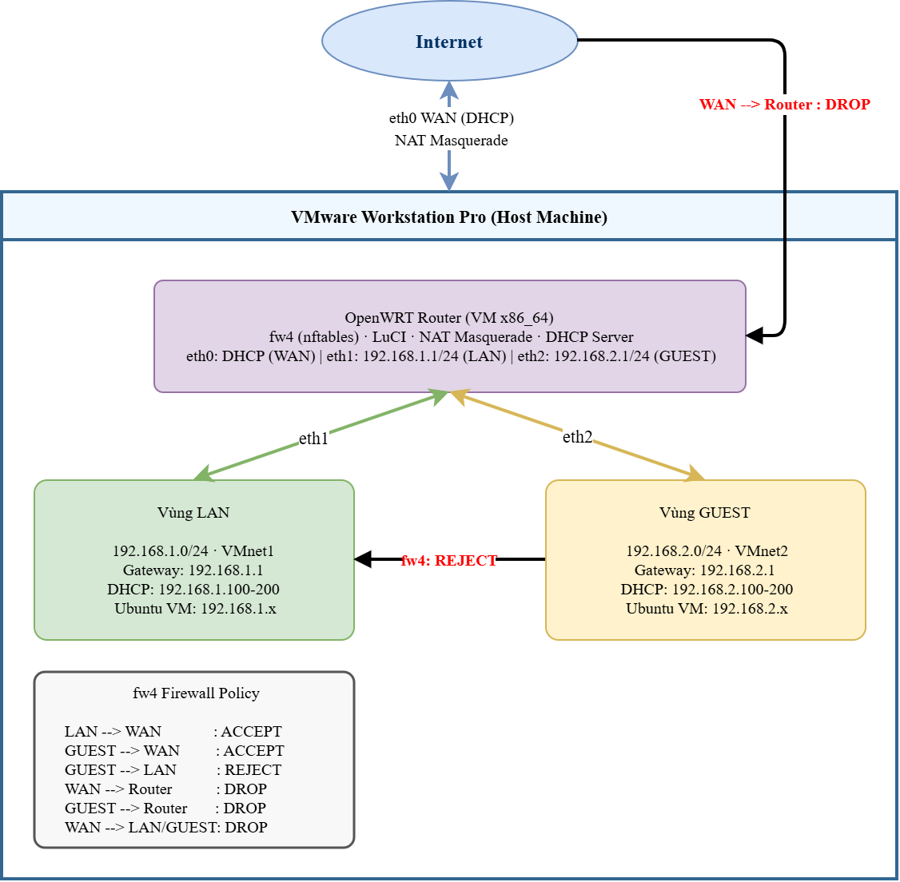

# Openwrt_Project
# Xây dựng Soft-Router không dây sử dụng OpenWRT và triển khai cơ chế Firewall bảo vệ mạng WLAN

> **Nhóm 18 - Lớp NT131.Q22**

---

## Kiến trúc mạng



## Các zone firewall

| Zone  | Interface | Network        | Input  | Forward | Output |
|-------|-----------|----------------|--------|---------|--------|
| WAN   | eth0      | NAT            | DROP   | DROP    | ACCEPT |
| LAN   | eth1      | 192.168.1.0/24 | ACCEPT | ACCEPT  | ACCEPT |
| GUEST | eth2      | 192.168.2.0/24 | REJECT | REJECT  | ACCEPT |

### Custom Rules

| Rule               | Hướng       | Port | Action |
|--------------------|-------------|------|--------|
| Block-WAN-SSH      | WAN🠖Router | 22   | DROP   |
| Block-WAN-HTTP     | WAN🠖Router | 80   | DROP   |
| Block-GUEST-to-LAN | GUEST🠖LAN  | any  | DROP   |
| GUEST🠖WAN Forward | GUEST🠖WAN  | any  | ACCEPT |

---

## Cấu trúc project

```
NT131-Firewall-OpenWRT/
├── docs/
│   └── Setup.md .................. Hướng dẫn cài đặt VM + OpenWRT
├── configs/
│   ├── network/
│   │   └── interfaces ............ Cấu hình WAN/LAN/GUEST
│   └── firewall/
│       └── fw4-rules.sh .......... Script UCI fw4 zones & rules
├── tests/
│   └── nmap-results/ ............. Kết quả kiểm thử nmap
├── report/
│   └── NT131_Nhom18_BaoCao.docx .. Báo cáo chính thức
└── README.md
```

---

## Môi trường & công cụ

| Thành phần      | Phiên bản / Chi tiết       |
|-----------------|---------------------------|
| OpenWRT         | 24.10.x (x86/64)          |
| Firewall        | fw4 / nftables            |
| Web UI          | LuCI                      |
| Ảo hóa          | VMware Workstation Pro    |
| OS thử nghiệm   | Ubuntu (LAN & GUEST)      |
| Kiểm thử        | nmap, ping, curl          |

---

## Hướng dẫn nhanh

### Cài đặt môi trường
> Xem chi tiết tại [`docs/Setup.md`](docs/Setup.md)

### Áp dụng cấu hình firewall
```bash
# SSH vào OpenWRT
ssh root@192.168.1.1

# Chạy script cấu hình
sh /tmp/fw4-rules.sh

# Kiểm tra rules
nft list ruleset
```

### Kiểm thử
```bash
# Từ GUEST (192.168.2.x) — phải bị chặn
ping 192.168.1.1

# Từ LAN (192.168.1.x) — phải thông
ping 8.8.8.8
```
